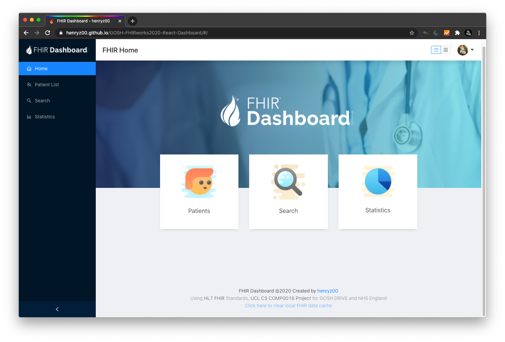

# Using React to Design a High Performance FHIR Data Manager and Visualizer

## About

My name is [Henry Zhang](https://www.linkedin.com/in/henry-zhang-9802/), currently a second-year computer science student from University College London. I'm always keen to develop user-friendly applications utilizing the latest technologies and frameworks that help to analyse useful data, while also refining small details keeping HCI in mind.

## Introduction

This project was built at UCL COMP0016 FHIRworks Hackathon (for GOSH DRIVE and NHS England). The app provides an easy to use, responsive web and mobile dashboard interfaces for users to view, search and analyse patient datasets in [HL7 FHIR Standard](https://www.hl7.org/fhir/).

FHIR stands for Fast Healthcare Interoperability Resources, it is designed to standardizing electronic health records (EHR) data exchange. Because open and extensible nature, many healthcare services including NHS Great Ormond Street Hospital ([GOSH Drive](https://www.goshdrive.com/)) are researching and using the standard extensively.

The FHIR dataset is provided by GOSH DRIVE, white also utilizing [Microsoft Azure API for FHIR](https://docs.microsoft.com/en-us/azure/healthcare-apis/overview) and [ToolSuite system](https://techcommunity.microsoft.com/t5/educator-developer-blog/ucl-ixn-amp-gosh-fhir-toolsuite-for-healthcare-developers-on/ba-p/1451361) on Azure Cloud developed by UCL IXN.

## Project Overview

The dashboard prototype came with three main sections (Patient list viewer, Advanced Search, Statistics), it was built with [React.js](https://reactjs.org/) and [React Router](https://reacttraining.com/react-router/), this was my first time learning and using react.

The user interface is built based on React Ant Design library, with self-customized CSS and modified designs. The UI is fully responsive, with a separate mobile tab menu for native mobile app experience. 

### FHIR Data Explorer
The patient list can be viewed by a choice of table or card layout. In the table layout, the user can easily sort or reorder the entire database by clicking the table head, and view full patient observation in a popup drawer. 

For each observation entry, more advanced user can even view the raw FHIR json for more detailed info.

### Search
Due to the extensiveness of FHIR data structure, each search rule has to be carefully written, thus it is quite hard to write an advanced search function with these many data inputs. However, with the help of the antd library, quite promising results can still be achieved. Additionally, the user can also use `Exact match` function to filter more strict matching result.

### Statistics
[Chart.js React](https://github.com/jerairrest/react-chartjs-2) is used for data visualization. A filter and restructure function has been written to manipulate the raw FHIR data and making it easier to be analyzed in the app.

### Responsive Design
The web app is fully responsive, down to every smaller detail. To achieve this, a lot of CSS and media rule has to be re-written. In addition, a separate menu component for mobile and desktop (bottom tab bar using React Native component and side menu using standard React), which will be enabled and disabled programmatically. By doing this, it will also make the process to migrate the app to a React native app much easier, which means the web app can be easily installed on native smartphone and tablets.

## Result

<iframe width="560" height="315" src="https://www.youtube.com/embed/TaC_4upDGn8" frameborder="0" allow="accelerometer; autoplay; encrypted-media; gyroscope; picture-in-picture" allowfullscreen></iframe>

---

The project source code can be found at [https://github.com/henryz00/GOSH-FHIRworks2020-React-Dashboard](https://github.com/henryz00/GOSH-FHIRworks2020-React-Dashboard)

Short video demo: [https://www.youtube.com/embed/TaC_4upDGn8](https://www.youtube.com/embed/TaC_4upDGn8)

Henry's Linkedin: [https://www.linkedin.com/in/henry-zhang-9802/](https://www.linkedin.com/in/henry-zhang-9802/)

