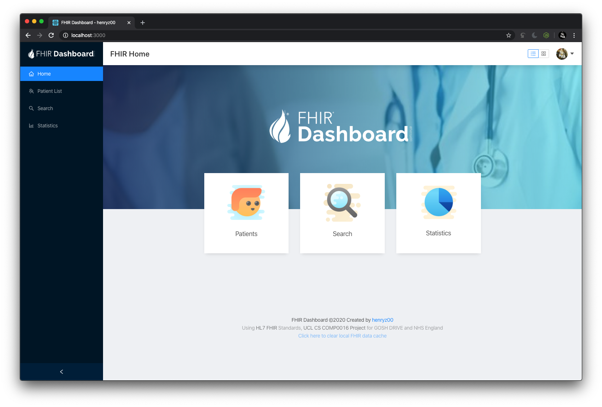
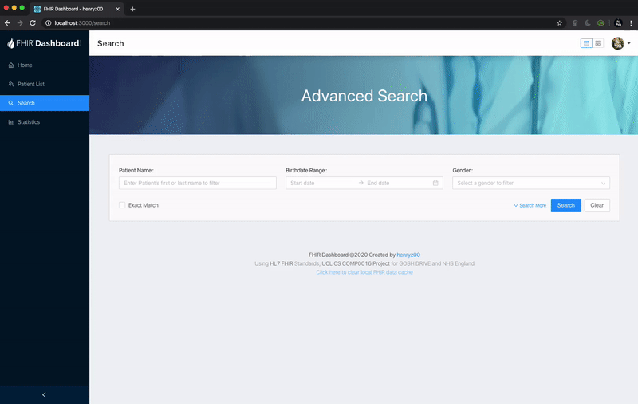
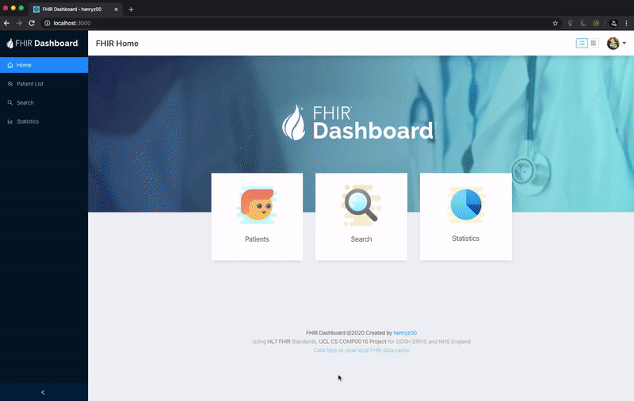
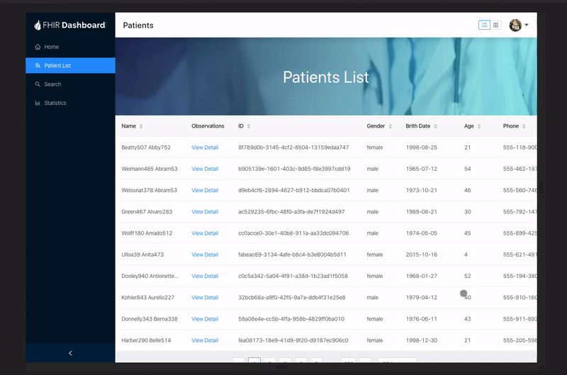

# FHIR Responsive React Dashboard

This project is built at UCL COMP0016 FHIRworks Hackathon (for GOSH DRIVE and NHS England). The app provides an easy to use, responsive web and mobile dashboard interfaces for users to view, search and analyse FHIR datasets.

## About

[Run the app on github pages](https://henryzt.github.io/GOSH-FHIRworks2020-React-Dashboard/). The dotnet server API can be found at [FHIRworks_2020](https://github.com/goshdrive/FHIRworks_2020).

---

The app is built using:

- [React.js](https://reactjs.org/) + [React Router](https://reacttraining.com/react-router/)
- [Ant Design](https://ant.design/)
- [Chart.js React](https://github.com/jerairrest/react-chartjs-2)

With API and dataset:
- [GOSH Drive Azure API](https://github.com/goshdrive/FHIRworks_2020)
- [HL7 FHIR Standard](https://www.hl7.org/fhir/) (Fast Healthcare Interoperability Resources Standard)
- Home page icons from [Icons8](https://icons8.com/)
- Part of the logo designed came from FHIR (R) Logo

The theme of the project is *"6. Responsive design app form pulling data from a series of FHIR records e.g. retrieving and flattening the data, from a front-end design"*, however, it is also combined with *"2. Graphing data"* and *"10. Searching"*.

## Screenshots

### Overview
The dashboard prototype came with three main sections (Patient list viewer, Advanced Search, Statistics), utilising FHIR data strcuture and standards. 

The user interface is built based on React Ant Design library, with lots of self-customized CSS and modified designs. The UI is fully responsive, with a separate mobile tab menu for native mobile app experience. 

### FHIR Data Explorer
The patient list can be viewed by a choice of table or card layout. In the table layout, the user can easily sort or reorder the entire database by clicking the table head, and view full patient observation in a popup drawer. 

For each observation entry, more advanced user can even view the raw FHIR json for more detailed info.

### Search
Due to the extensiveness of FHIR data structure, each search rule has to be carefully written, thus it is quite hard to write an advanced search function with these many data inputs. However, with the help of the antd library, quite promising results can still be achieved. Additionally, the user can also use `Exact match` function to filter more strict matching result.

### Statistics
[Chart.js React](https://github.com/jerairrest/react-chartjs-2) is used for data visualization. A filter and restructure function has been written to manipulate the raw FHIR data and making it easier to be analyzed in the app.

### Responsive Design
The web app is fully responsive, down to every smaller detail. To achieve this, a lot of CSS and media rule has to be re-written. In addition, a separate menu component for mobile and desktop (bottom tab bar using React Native component and side menu using standard React), which will be enabled and disabled programmatically. By doing this, it will also make the process to migrate the app to a React native app much easier, which means the web app can be easily installed on native smartphone and tablets.

### Other Details

## Available Scripts

In the project directory, you can run:

### `yarn start`

Runs the app in the development mode. 
Open [http://localhost:3000](http://localhost:3000) to view it in the browser.

The page will reload if you make edits. 
You will also see any lint errors in the console.

### `yarn build`

Builds the app for production to the `build` folder. 
It correctly bundles React in production mode and optimizes the build for the best performance.

The build is minified and the filenames include the hashes. 
Your app is ready to be deployed!

See the section about [deployment](https://facebook.github.io/create-react-app/docs/deployment) for more information.

